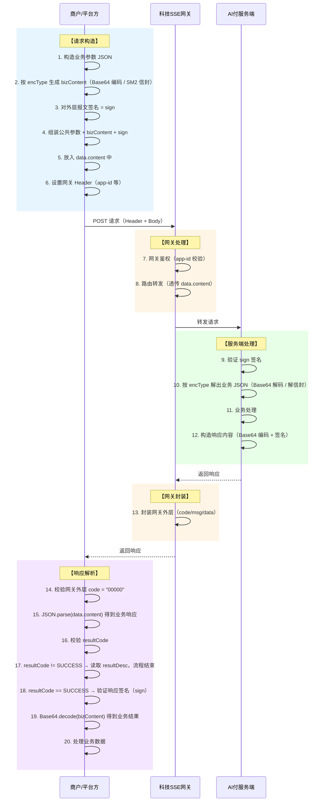

# AI付开放接口 - 协议总览

> 版本：v1.6 | 更新时间：2026-07-22

---

## 1. 概述

本协议定义了京东AI付面向外部商户/平台方的标准API交互规范。

商户请求经过两层协议：


| 层级           | 说明                                                                   | 关注点                                 |
| -------------- | ---------------------------------------------------------------------- | -------------------------------------- |
| **网关通信层** | 商户通过科技SSE网关发起HTTP请求，网关负责路由和鉴权                    | Header、请求体外层结构、响应体外层结构 |
| **业务交互层** | AI付业务参数嵌套在网关报文体内，包含签名验签、报文编码/加密等安全机制 | data.content 内的业务参数、签名、编码/加密 |

与传统京东支付API的差异：


| 对比项   | 传统京东支付API           | AI付开放协议                                                     |
| -------- | ------------------------- | ---------------------------------------------------------------- |
| 报文加密 | AP7全报文加密（证书体系） | Base64 编码 / **SM2 证书数字信封**（由 `encType` 分派，仅请求方向） |
| 签名方式 | SHA-256 + 证书            | **签名验签**（支持SHA-256 / SM3）                                |
| 加密算法 | 仅支持AP7                 | **双算法支持**：AES-256-GCM（国际）/ SM4-GCM（国密）             |
| 通信协议 | HTTPS同步                 | HTTPS同步                                                        |
| 适用场景 | Web/APP收银台             | **AI智能体 / MCP场景**                                           |

---

## 2. 整体交互时序



---

## 3. 网关通信协议

本节定义商户与科技SSE网关之间的通信规范。所有请求必须通过SSE网关，网关负责路由鉴权后透传至AI付服务端。

### 3.1 环境信息


| 环境               | 基础地址                     | 说明                   |
| ------------------ | ---------------------------- | ---------------------- |
| 预发环境（办公网） | `http://sse-pre.jd.com/api/` | 联调测试（办公网访问） |
| 预发环境（公网）   | 待提供                       | 联调测试（公网访问）   |
| 生产环境           | `https://sse.jd.com/api/`    | 正式线上环境           |


| 项       | 说明                                 |
| -------- | ------------------------------------ |
| 编码格式 | UTF-8                                |
| 数据格式 | application/json                     |
| 调用方式 | POST                                 |
| 传输协议 | HTTPS（TLS 1.2+） / HTTP（预发环境） |

### 3.2 网关请求头（Header）


| 参数名            | 必填 | 说明                                                   |
| ----------------- | ---- | ------------------------------------------------------ |
| `app-id`          | 是   | 服务商商户入驻时分配的唯一身份标识                     |
| `Content-Type`    | 是   | 固定值：`application/json`                             |
| `encrypt-type`    | 是   | 报文加密方式，当前固定值：`NONE`（预留扩展）           |
| `login-type`      | 是   | 登录类型，`0`：不登录；`1`：Cookie登录；`2`：Token登录 |
| `source-type`     | 是   | 来源类型，`H5`：H5页面；`APP`：APP端；`PC`：PC端       |
| `secret-key-type` | 是   | 密钥类型，`1`：对称密钥                                |
| `cookie`          | 否   | 当`login-type=1` 时必传，京东用户登录态凭证（pt_key）  |
| `stream-type`     | 否   | 是否流式输出，默认 true，非流式传 false                |

> **说明**：`app-id` 由网关侧分配，用于标识服务商身份，与AI付业务层的 `appId` 相互独立。网关通过 `app-id` 进行路由和鉴权，AI付业务通过请求体中的 `appId` + `merchantNo` 进行业务校验。

### 3.3 网关请求体结构

```json
{
  "data": {
    "content": {
      // AI付业务参数（见第4节）
    }
  }
}
```

AI付业务参数以 JSON 对象形式放入 `data.content` 中，网关透传至AI付服务端。

### 3.4 网关响应体结构

网关响应分为**外层**和**数据体**两部分：

```json
{
  "code": "00000",
  "msg": "成功",
  "data": {
    "content": "{\"appId\":\"AI_PAY_001\",\"merchantNo\":\"220000000001\", ...}",
    "status": "FINISHED",
    "encryptType": "NONE"
  }
}
```

#### 3.4.1 网关外层


| 参数名       | 参数编码 | 必填 | 类型        | 说明                     |
| ------------ | -------- | ---- | ----------- | ------------------------ |
| 网关响应码   | code     | 是   | String(8)   | `00000` 表示网关处理成功 |
| 网关响应描述 | msg      | 是   | String(128) | 网关响应描述信息         |
| 数据体       | data     | 是   | Object      | 网关数据体，见 3.4.2     |

#### 3.4.2 网关数据体（data）


| 参数名   | 参数编码    | 必填 | 类型       | 说明                                                            |
| -------- | ----------- | ---- | ---------- | --------------------------------------------------------------- |
| 业务内容 | content     | 是   | **String** | AI付业务响应，**JSON 字符串**，需 `JSON.parse` 后使用（见 4.3） |
| 处理状态 | status      | 是   | String(16) | `FINISHED`：处理完成                                            |
| 加密类型 | encryptType | 是   | String(8)  | 当前固定值：`NONE`                                              |

> **注意**：`data.content` 是 JSON **字符串**而非对象，商户须先 `JSON.parse` 解析后再提取业务数据。

---

## 4. 业务交互协议

本节定义AI付业务层的参数规范。业务参数嵌套在网关报文体内，请求放入 `data.content` 对象中，响应从 `data.content` 字符串中解析。

### 4.1 接口清单


| # | 接口         | 路径                                | 通信方式  | 说明                                  |
| - | ------------ | ----------------------------------- | --------- | ------------------------------------- |
| 1 | AI下单       | `/pay-ai-agent/createOrder`         | HTTPS同步 | 准入校验+下单一体，按授权状态自动路由 |
| 2 | 支付结果查询 | `/pay-ai-agent/queryPayResult`      | HTTPS同步 | 商户主动轮询订单支付状态              |
| 3 | 退款         | `/pay-ai-agent/refund`              | HTTPS同步 | 商户对已支付成功订单发起退款申请      |
| 4 | 退款结果查询 | `/pay-ai-agent/queryRefundResult`   | HTTPS同步 | 商户主动查询退款交易结果              |

> 完整请求 URL = 基础地址 + 路径，如：`http://sse-pre.jd.com/api/pay-ai-agent/createOrder`

### 4.2 公共请求参数（data.content 内）


| 参数名称     | 参数编码   | 是否必填 | 参数类型    | 描述                                                                     |
| ------------ | ---------- | -------- | ----------- | ------------------------------------------------------------------------ |
| 应用ID       | appId      | 是       | String(32)  | AI付分配的应用标识                                                       |
| 二级商户号   | merchantNo | 是       | String(32)  | 商户号（12位数字，由京东侧分配）                                         |
| Agent标识    | agentId    | 是       | String(64)  | 调用方 Agent 唯一标识，用于 Agent 身份识别、策略路由、风控与数据统计     |
| 请求唯一标识 | reqNo      | 是       | String(64)  | 商户侧生成，全局唯一                                                     |
| 时间戳       | timestamp  | 是       | Long        | 请求时间戳，毫秒级（13位），有效期±5分钟                                 |
| 随机字符串   | nonce      | 是       | String(32)  | 防重放攻击，每次请求唯一                                                 |
| 协议版本     | version    | 是       | String(4)   | 固定值：`1.0`                                                            |
| 加密类型     | encType    | 否       | String(8)   | `bizContent` 生成方式：`NONE`（默认，Base64 编码）/ `SM2`（SM2 签名数字信封），见 5.1 节 |
| 签名类型     | signType   | 是       | String(8)   | `SHA256` 或 `SM3`，见 5.2 节                                             |
| 签名         | sign       | 是       | String(128) | 按 5.2 节规则生成                                                        |
| 业务数据     | bizContent | 是       | String      | 业务参数的传输载体，生成方式由 `encType` 决定（见 5.1 节）               |

### 4.3 公共响应参数（data.content 解析后）

`data.content` 经 `JSON.parse` 后得到以下结构，与请求公共参数对称：


| 参数名称     | 参数编码   | 是否必填 | 参数类型    | 描述                                                                                 |
| ------------ | ---------- | -------- | ----------- | ------------------------------------------------------------------------------------ |
| 应用ID       | appId      | 是       | String(32)  | 与请求一致                                                                           |
| 二级商户号   | merchantNo | 是       | String(32)  | 与请求一致                                                                           |
| Agent标识    | agentId    | 是       | String(64)  | 与请求一致，用于商户侧确认响应所属 Agent                                             |
| 请求唯一标识 | reqNo      | 是       | String(64)  | 与请求一致                                                                           |
| 业务结果码   | resultCode | 是       | String(16)  | `SUCCESS`：业务处理成功；其他值见错误码表                                            |
| 业务结果描述 | resultDesc | 是       | String(128) | 结果描述信息，失败时返回具体原因                                                     |
| 时间戳       | timestamp  | 是       | Long        | 响应时间戳                                                                           |
| 签名类型     | signType   | 否       | String(8)   | 业务成功时返回，与请求一致                                                           |
| 签名         | sign       | 否       | String(128) | 业务成功时返回，商户须验签                                                           |
| 业务数据     | bizContent | 否       | String      | 业务成功时返回，业务响应 JSON 经 Base64 编码后的字符串（各接口不同，见具体接口文档） |

> **说明**：响应方向统一为 Base64 编码 + 签名，不随请求的 `encType` 变化。当 `resultCode != SUCCESS` 时（如参数缺失、签名校验失败等前置校验错误），响应中不包含 `sign` 和 `bizContent` 字段，商户无需验签，直接读取 `resultDesc` 获取错误原因即可。

---

## 5. 安全机制

AI付协议的安全机制由三部分组成，各司其职：


| 机制 | 保护对象 | 密钥体系 | 是否必选 |
| ---- | -------- | -------- | -------- |
| 外层签名（`sign`） | 整个请求/响应报文的完整性与来源可信 | 共享密钥 signKey（对称） | 必选 |
| `bizContent` 编码/加密（`encType`） | 业务报文的传输形态与保密性 | 无密钥（Base64）/ 非对称证书（SM2） | 必选（二选一，缺省 `NONE`） |
| 敏感字段加密 | 单个敏感字段（证件号、银行卡号等） | 共享密钥 encKey（对称） | 可选 |

处理顺序固定为「**先编码/加密业务报文，再对整体报文加签**」。响应方向统一为 Base64 编码 + 外层签名，不随请求的 `encType` 变化（与京东支付国密体系一致）。

### 5.1 bizContent 编码与加密（encType）

`bizContent` 是业务参数的传输载体，其生成方式由公共请求参数 `encType` 决定：


| encType | bizContent 生成方式 | 说明 |
| ------- | ------------------- | ---- |
| `NONE`（缺省） | `Base64(业务JSON)` | 默认模式，安全性由 HTTPS + 外层签名共同保障 |
| `SM2` | `signEnvelop(业务JSON)`（SM2 签名数字信封） | 报文级加密 + 商户身份签名，适用于国密合规、高安全等级场景 |

#### 5.1.1 Base64 模式（encType=NONE，默认）

业务请求参数以 JSON 格式组装后，使用 **标准 Base64**（RFC 4648）进行编码，作为 `bizContent` 字段传输。

**Base64 仅做编码传输，不提供加密保护**，安全性由 HTTPS + 签名机制共同保障。

```java
// 编码
String bizJson = "{\"outTradeNo\":\"AI20260512001\",\"tradeAmount\":100}";
String bizContent = Base64.getEncoder().encodeToString(bizJson.getBytes(StandardCharsets.UTF_8));

// 解码
String decoded = new String(Base64.getDecoder().decode(bizContent), StandardCharsets.UTF_8);
```

#### 5.1.2 SM2 信封模式（encType=SM2）

`encType=SM2` 时，`bizContent` 为 **SM2 签名数字信封**（信封输出本身为 Base64 文本，直接作为 `bizContent` 传输，不再单独 Base64 编码）：

```
信封 = 商户私钥 SM2 签名（身份认证、防抵赖） + 京东公钥 SM2 加密（报文保密）
```

- **商户侧构造**：业务 JSON → signEnvelop（商户私钥签名 + 京东公钥加密）→ `bizContent`
- **服务端解析**：verifyEnvelop（京东私钥解密 + 商户公钥证书验签）→ 业务 JSON 明文
- 与京东支付国密商户接入方式一致，商户可复用既有国密 SDK

**与外层签名的关系**：信封密文作为 `bizContent` 整体参与 5.2 节外层签名，`encType` 字段同时参与签名（防止模式被降级篡改）。两层职责独立：


| 层 | 密钥体系 | 职责 |
| -- | -------- | ---- |
| 信封层 | 非对称密钥对（证书） | 业务报文的保密性 + 商户身份（防抵赖） |
| 外层签名层 | 共享密钥 signKey（对称） | 整个请求报文的传输完整性 |

**证书分发**：


| 密钥/证书 | 持有方 | 用途 | 分发方式 |
| --------- | ------ | ---- | -------- |
| 商户私钥（pfx） | 商户自持 | 请求信封内层签名 | 商户自行生成/保管 |
| 商户公钥证书 | 提交京东 | 服务端验信封签名 | 商户入驻/接入时提交京东登记 |
| 京东公钥证书 | 分发商户 | 商户加密信封 | 京东线下安全渠道分发 |
| 京东私钥 | 京东服务端保管 | 服务端解信封 | 京东内部密钥体系管理 |

**响应方向**：响应报文不使用证书加密，统一按 Base64 编码 + 签名处理，商户解析响应的流程与 Base64 模式完全一致。

**与 5.3 字段级加密的关系**：`encType=SM2` 时整个业务报文已被信封保护，字段级加密可不叠加。

### 5.2 签名机制

#### 5.2.1 支持的签名算法


| signType | 算法        | 说明                       |
| -------- | ----------- | -------------------------- |
| `SHA256` | HMAC-SHA256 | 国际标准，默认推荐         |
| `SM3`    | HMAC-SM3    | 国密标准，满足国密合规场景 |

#### 5.2.2 签名生成步骤

**第一步：构造待签名字符串**

将公共请求参数除 `sign` 和 `signType` 外的所有参数，按参数名 ASCII 码从小到大排序（字典序），使用 `&` 连接，格式为 `key1=value1&key2=value2&...`。空值参数不参与签名。

```
待签名字符串 = appId=AI_PAY_001&agentId=AGENT_ROKID_001&bizContent=eyJvdXRUcm...&merchantNo=220000000001&nonce=a1b2c3d4&reqNo=REQ20260512120000001&timestamp=1715500800000&version=1.0
```

**第二步：使用密钥进行签名**

```java
// SHA256签名
Mac hmac = Mac.getInstance("HmacSHA256");
hmac.init(new SecretKeySpec(secretKey.getBytes(), "HmacSHA256"));
byte[] signBytes = hmac.doFinal(stringToSign.getBytes(StandardCharsets.UTF_8));
String sign = Hex.encodeHexString(signBytes);  // 转为小写16进制字符串

// SM3签名（国密）
// 使用BouncyCastle等国密库，流程一致，算法替换为HmacSM3
```

**第三步：将 sign 放入请求参数**

#### 5.2.3 验签流程

接收方按照相同的规则构造待签名字符串，使用相同的密钥和算法计算签名，与请求中的 `sign` 字段进行比对。一致则验签通过。

#### 5.2.4 签名参与字段规则

**请求签名（商户→AI付）：**

以下公共请求参数参与签名（`sign` 和 `signType` 不参与）：


| 参与签名字段 | 参数编码   | 说明                                                              |
| ------------ | ---------- | ----------------------------------------------------------------- |
| 应用ID       | appId      | 始终参与                                                          |
| 二级商户号   | merchantNo | 始终参与                                                          |
| Agent标识    | agentId    | 始终参与                                                          |
| 请求唯一标识 | reqNo      | 始终参与                                                          |
| 时间戳       | timestamp  | 始终参与                                                          |
| 随机字符串   | nonce      | 始终参与                                                          |
| 协议版本     | version    | 始终参与                                                          |
| 业务数据     | bizContent | 始终参与（以传输形态为准：Base64 编码串或 SM2 信封密文作为值）    |
| 加密类型     | encType    | 非空时参与（防降级篡改）                                          |

> **说明**：`sign` 是签名结果本身，`signType` 是签名算法标识（元信息），两者均不参与签名计算。`signType` 被篡改时接收方会使用错误算法验签从而自然失败，无需额外保护。

排序规则：按参数编码 ASCII 升序排列，格式 `key1=value1&key2=value2&...`，空值参数不参与。

**响应签名（AI付→商户）：**

以下公共响应参数参与签名（`sign` 和 `signType` 不参与）：


| 参与签名字段 | 参数编码   | 说明                                    |
| ------------ | ---------- | --------------------------------------- |
| 应用ID       | appId      | 始终参与                                |
| 二级商户号   | merchantNo | 始终参与                                |
| Agent标识    | agentId    | 始终参与                                |
| 请求唯一标识 | reqNo      | 始终参与                                |
| 业务结果码   | resultCode | 始终参与                                |
| 业务结果描述 | resultDesc | 始终参与                                |
| 时间戳       | timestamp  | 始终参与                                |
| 业务数据     | bizContent | 始终参与（Base64 编码后的字符串作为值） |

排序和拼接规则同请求签名。

**响应签名示例：**

```
待签名字符串 = appId=AI_PAY_001&agentId=AGENT_ROKID_001&bizContent=eyJvdXRUcmFkZU5v...&merchantNo=220000000001&reqNo=REQ20260512120000001&resultCode=SUCCESS&resultDesc=处理成功&timestamp=1715500800123
```

#### 5.2.5 异常响应无签名说明

当请求因前置校验失败（如参数缺失、签名错误、商户不存在、时间戳过期等）而返回 `resultCode != SUCCESS` 时：

- 响应中**不包含** `sign`、`signType`、`bizContent` 字段
- 商户**无需验签**，直接读取 `resultCode` + `resultDesc` 处理错误
- 此类响应的数据完整性由 HTTPS 传输层保障

**无签名响应结构示例：**

```json
{
  "appId": "AI_PAY_001",
  "reqNo": "REQ20260512120000001",
  "resultCode": "PARAM_ERROR",
  "resultDesc": "merchantNo不能为空",
  "timestamp": 1715500800456
}
```

**设计原因**：前置校验失败意味着请求参数本身不完整或不合法，此时服务端可能无法确定对应的签名密钥（如 merchantNo 缺失），因此不进行签名。商户侧判断逻辑如下：

```
收到响应后：
  1. 先检查 resultCode
  2. 若 resultCode == SUCCESS → 必须验签（sign 字段存在），验签通过后再解码 bizContent
  3. 若 resultCode != SUCCESS → 无需验签（sign 字段不存在），直接读取 resultDesc 处理错误
```

### 5.3 敏感字段加密（可选）

对于部分敏感业务字段（如身份证号、银行卡号等），在生成 `bizContent` 前可先对这些字段值进行加密。

#### 5.3.1 支持的加密算法


| encType | 算法        | 密钥长度 | 模式 | 说明           |
| ------- | ----------- | -------- | ---- | -------------- |
| `AES`   | AES-256-GCM | 256 bit  | GCM  | 国际标准，推荐 |
| `SM4`   | SM4-GCM     | 128 bit  | GCM  | 国密标准       |

> 说明：本节的 `encType` 为字段级加密算法标识（字段值前缀），与公共请求参数中的报文级 `encType` 是两个独立概念。

#### 5.3.2 加密规范

- **GCM 模式**：同时提供加密和认证，无需额外的 MAC 计算
- **IV（初始化向量）**：每次加密生成 12 字节随机 IV，与密文一起传输
- **密文格式**：`Base64(IV + Ciphertext + AuthTag)`，其中 AuthTag 为 16 字节
- **密钥分发**：加密密钥通过线下安全渠道分发，与签名密钥独立管理

```java
// AES-256-GCM 加密示例
byte[] iv = new byte[12];
SecureRandom.getInstanceStrong().nextBytes(iv);
Cipher cipher = Cipher.getInstance("AES/GCM/NoPadding");
GCMParameterSpec spec = new GCMParameterSpec(128, iv);
cipher.init(Cipher.ENCRYPT_MODE, new SecretKeySpec(aesKey, "AES"), spec);
byte[] ciphertext = cipher.doFinal(plaintext.getBytes(StandardCharsets.UTF_8));
byte[] result = ByteBuffer.allocate(iv.length + ciphertext.length)
    .put(iv).put(ciphertext).array();
String encrypted = Base64.getEncoder().encodeToString(result);
```

```java
// SM4-GCM 加密示例（使用BouncyCastle）
byte[] iv = new byte[12];
SecureRandom.getInstanceStrong().nextBytes(iv);
Cipher cipher = Cipher.getInstance("SM4/GCM/NoPadding", "BC");
GCMParameterSpec spec = new GCMParameterSpec(128, iv);
cipher.init(Cipher.ENCRYPT_MODE, new SecretKeySpec(sm4Key, "SM4"), spec);
byte[] ciphertext = cipher.doFinal(plaintext.getBytes(StandardCharsets.UTF_8));
byte[] result = ByteBuffer.allocate(iv.length + ciphertext.length)
    .put(iv).put(ciphertext).array();
String encrypted = Base64.getEncoder().encodeToString(result);
```

#### 5.3.3 加密字段标识

当业务字段使用了加密时，字段值格式为：`{encType}|{加密后的密文}`

```json
{
  "idName": "AES|SGVsbG8gV29ybGQ=",
  "idNo": "SM4|dGVzdCBkYXRh..."
}
```

---

## 6. 完整示例

### 6.1 请求示例

**示例一：Base64 模式（`encType` 缺省，cURL 预发环境）：**

```bash
curl --location 'http://sse-pre.jd.com/api/pay-ai-agent/createOrder' \
--header 'app-id: 823f4832b65373538b48e7d1a01c8e7b' \
--header 'cookie: pt_key=AAJp-vmvADCIBxttVVzX0V2nAiAJWQOBNCfbUXWffvpz4qwnXoSZ7lKrQlULEzjdHrJSNUsBiU0' \
--header 'encrypt-type: NONE' \
--header 'login-type: 1' \
--header 'source-type: H5' \
--header 'secret-key-type: 1' \
--header 'Content-Type: application/json' \
--data '{
  "data": {
    "content": {
      "appId": "AI_PAY_001",
      "merchantNo": "220000000001",
      "agentId": "AGENT_ROKID_001",
      "reqNo": "REQ20260512120000001",
      "timestamp": 1715500800000,
      "nonce": "a1b2c3d4e5f6",
      "version": "1.0",
      "signType": "SHA256",
      "sign": "3a5b8c9d2e1f...",
      "bizContent": "eyJvdXRUcmFkZU5vIjoiQUkyMDI2MDUxMjAwMSIsInRyYWRlQW1vdW50IjoiMTAwIiwiY3VycmVuY3kiOiJDTlkifQ=="
    }
  }
}'
```

**示例二：SM2 信封模式（`encType=SM2`，请求体部分）：**

```json
{
  "data": {
    "content": {
      "appId": "AI_PAY_001",
      "merchantNo": "220000000001",
      "agentId": "AGENT_ROKID_001",
      "reqNo": "REQ20260512120000002",
      "timestamp": 1715500800000,
      "nonce": "f6e5d4c3b2a1",
      "version": "1.0",
      "encType": "SM2",
      "signType": "SM3",
      "sign": "9f8e7d6c5b4a...",
      "bizContent": "MIIBnjCCAYagAwIBAgIU...(SM2信封密文，Base64)..."
    }
  }
}
```

> 两种模式仅 `encType` 与 `bizContent` 内容不同，外层签名规则完全一致（`encType` 参与签名）。国密合规场景建议 `encType=SM2` 与 `signType=SM3` 组合使用。

### 6.2 响应示例

> 响应方向不区分 `encType` 模式，以下示例对两种模式通用。

#### 6.2.1 成功响应

**原始响应（网关外层）：**

```json
{
  "code": "00000",
  "msg": "成功",
  "data": {
    "content": "{\"appId\":\"AI_PAY_001\",\"merchantNo\":\"220000000001\",\"agentId\":\"AGENT_ROKID_001\",\"reqNo\":\"REQ20260512120000001\",\"resultCode\":\"SUCCESS\",\"resultDesc\":\"处理成功\",\"timestamp\":1715500800123,\"signType\":\"SHA256\",\"sign\":\"7f8e9d0c1b2a3e4f...\",\"bizContent\":\"eyJvdXRUcmFkZU5vIjoiTUVSMjAyNjA1MTIwMDEiLCJ0cmFkZU5vIjoiSkQyMDI2MDUxMjAwMDAwMSIsImFpVG9rZW5QYXJhbSI6InRva2VuX3h4eCIsInNka0FwcElkIjoiYWlwYXlfYXBwXzAwMSJ9\"}",
    "status": "FINISHED",
    "encryptType": "NONE"
  }
}
```

**data.content 经 JSON.parse 后：**

```json
{
  "appId": "AI_PAY_001",
  "merchantNo": "220000000001",
  "agentId": "AGENT_ROKID_001",
  "reqNo": "REQ20260512120000001",
  "resultCode": "SUCCESS",
  "resultDesc": "处理成功",
  "timestamp": 1715500800123,
  "signType": "SHA256",
  "sign": "7f8e9d0c1b2a3e4f...",
  "bizContent": "eyJvdXRUcmFkZU5vIjoiTUVSMjAyNjA1MTIwMDEiLCJ0cmFkZU5vIjoiSkQyMDI2MDUxMjAwMDAwMSIsImFpVG9rZW5QYXJhbSI6InRva2VuX3h4eCIsInNka0FwcElkIjoiYWlwYXlfYXBwXzAwMSJ9"
}
```

**bizContent 经 Base64 解码后：**

```json
{
  "outTradeNo": "MER20260512001",
  "tradeNo": "JD20260512000001",
  "aiTokenParam": "token_xxx",
  "sdkAppId": "aipay_app_001"
}
```

#### 6.2.2 失败响应（参数校验失败，无签名）

**原始响应（网关外层）：**

```json
{
  "code": "00000",
  "msg": "成功",
  "data": {
    "content": "{\"appId\":\"AI_PAY_001\",\"reqNo\":\"REQ20260512120000002\",\"resultCode\":\"PARAM_ERROR\",\"resultDesc\":\"merchantNo不能为空\",\"timestamp\":1715500800456}",
    "status": "FINISHED",
    "encryptType": "NONE"
  }
}
```

**data.content 经 JSON.parse 后：**

```json
{
  "appId": "AI_PAY_001",
  "reqNo": "REQ20260512120000002",
  "resultCode": "PARAM_ERROR",
  "resultDesc": "merchantNo不能为空",
  "timestamp": 1715500800456
}
```

> **注意**：前置校验失败时，响应中无 `sign`、`signType`、`bizContent` 字段，商户无需验签。

### 6.3 响应解析步骤

以下解析流程对两种 `encType` 模式完全一致（响应方向不区分模式）：

```
第一步：校验网关外层
└─ code == "00000" → 网关处理成功，继续解析
└─ code != "00000" → 网关异常，读取 msg 获取错误原因

第二步：解析业务内容
└─ JSON.parse(data.content) → 得到业务响应对象（appId、resultCode、resultDesc 等）

第三步：校验业务结果码
└─ resultCode == "SUCCESS" → 继续第四步
└─ resultCode != "SUCCESS" → 业务前置校验失败（如参数缺失、签名错误），
直接读取 resultDesc 获取原因，无需验签，流程结束

第四步：验证响应签名
└─ 按 5.2 节规则对响应公共参数验签，确认数据未被篡改

第五步：解码业务数据
└─ Base64.decode(bizContent) → 得到业务结果 JSON

第六步：处理业务数据
└─ 提取具体业务字段，执行后续逻辑
```

## 7. 接入须知

### 7.1 密钥与证书管理

- 服务商入驻签约后，科技网关侧分配 `app-id`（Header 中传递，用于网关鉴权路由）
- AI付业务侧分配 `appId` + `merchantNo`（请求体中传递，用于业务校验）
- 签名密钥（signKey）：用于外层 HMAC 签名，通过线下安全渠道分发
- 字段级加密密钥（encKey）：用于 5.3 节敏感字段加密（可选），与 signKey 独立分发
- SM2 信封证书（`encType=SM2` 的商户）：商户公钥证书于入驻/接入时提交京东登记；京东公钥证书由京东线下安全渠道分发；商户私钥（pfx）及密码由商户自持
- 支持密钥/证书轮换：新旧密钥或新旧证书可设置并行生效窗口（建议72小时）；证书到期前由京东提前通知更换

### 7.2 幂等性

- 相同 `reqNo` 的请求视为同一请求，服务端保证幂等处理
- `createOrder` 接口中，相同 `outTradeNo`（商户订单号）保证不重复创建京东侧订单

### 7.3 频率限制


| 接口                | QPS限制  | 说明                       |
| ------------------- | -------- | -------------------------- |
| createOrder         | 100/商户 | -                          |
| queryPayResult      | 200/商户 | 建议轮询间隔 2~3 秒        |
| refund              | 50/商户  | -                          |
| queryRefundResult   | 100/商户 | 建议轮询间隔 3~5 秒        |
